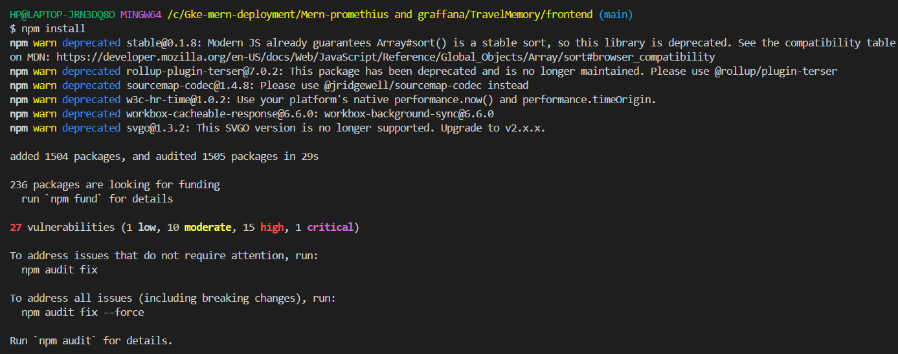

## Graded Assignment on MERN Application with Grafana and Prometheus

# Step 1. MERN Application Setup:
- Clone the below github repository GitHub repository:-
git clone https://github.com/UnpredictablePrashant/TravelMemory.git


# Step 2: Install Dependencies:
- Navigate to the frontend/ and backend/ folders, and install dependencies:



- For backend:


# Step 3: Set up environment variables as below:


# Step 4: Create a .env file in both backend directories with necessary environment variables (e.g., MongoDB connection string, its port ,etc).

# Step 5: Run the MERN application: 
- Open two terminals: one for the frontend and one for the backend.


- For frontend:

- You need to hit npm start in the frontend directory of the project.


# Step6. Integrate Prometheus for Node.js Backend Metrics:

# 2. Integrate Prometheus for Node.js Backend Metrics:

- Step 1: Install Prometheus client library
In the backend, install the Prometheus client for Node.js. By hitting below command “npm install prom-client".


- Step 2: Expose Prometheus metrics
In your backend/server.js, import the prom-client package and expose metrics like API response times, request counts, and error rates.


- Step 3: Set up MongoDB monitoring
- Use MongoDB Exporter to monitor the database.

- Install MongoDB Exporter:
  “docker run -d --name mongodb_exporter -p 9216:9216 bitnami/mongodb-exporter”

- Configure Prometheus to scrape MongoDB metrics.

- Step 4: Configure Prometheus:
- Set up a prometheus.yml configuration file to scrape your Node.js backend and MongoDB exporter.


# 3. Enhance Grafana Dashboards

- Step 1: Install and set up Grafana
- Install Grafana and configure Prometheus as a data source.


- Open Grafana UI at http://localhost:3000


- Needs to login as admin in uername and password section you need to hit admin as well then you can change you password to your choice and proceeed further.

- Step 3: Create Dashboards:
- Create custom dashboards in Grafana for:
- MongoDB health (connections, memory usage, query time)
- Frontend performance (use Prometheus metrics if applicable)

# 4. Log Aggregation with Loki:
- Step 1: Install Loki and Promtail
- Use Loki for log aggregation.


- Step 2: Configure Prom tail to collect logs:
- Create a promtail-config.yml file to scrape logs from your Node.js application.

- Step 3: Create Grafana Dashboard for logs:
- Add Loki as a data source in Grafana.
- Create dashboards to visualize logs in Grafana.

# 5. Implement Distributed Tracing with Jaeger:
- Step 1: Install Jaeger
- Run Jaeger as a Docker container.

docker run -d --name=jaeger -e COLLECTOR_ZIPKIN_HTTP_PORT=9411 -p 5775:5775/udp \
-p 6831:6831/udp -p 6832:6832/udp -p 5778:5778 \
-p 16686:16686 -p 14268:14268 -p 14250:14250 \
-p 9411:9411 jaegertracing/all-in-one:1.32


- Step 2: Integrate Jaeger with Node.js
- Use OpenTelemetry to send traces to Jaeger.


- Modify your backend to send traces to Jaeger:
- This will start Jaeger, and you can access the Jaeger UI at http://localhost:16686


- Step 1: Install OpenTelemetry for Node.js
- Installed the necessary OpenTelemetry libraries for tracing:


Step 3: Modify index.js to Enable Tracing:

- Create a new file (optional for better organization): Create a file named tracing.js to configure OpenTelemetry. This will keep your code cleaner.


- 2. Modify index.js: Import tracing.js at the top of your index.js file so that the tracing is initialized when the backend starts.


# 6. Alerting and Anomaly Detection:
- Step 1: Create Alerting Rules
- Set up alerting rules in Prometheus for application-specific metrics, such as response time exceeding a threshold.

- Create the alert.rules.yml file:

- Step 2: Configure Alertmanager

- Install Alertmanager:

- Visit the official Alertmanager releases page on GitHub:


- Download the appropriate version for your system:
- alertmanager-0.27.0.illumos-amd64.tar.gz in my case.
- Example for Linux:- wget

https://github.com/prometheus/alertmanager/releases/download/v0.26.0/alertmanager-0.26.0.linux-amd64.tar.gz


- Step 2: Extract the Files:
- Extract the downloaded file to a directory:
- For Linux/macOS:


- Navigate to the extracted folder:


- Step 3: Configure Alertmanager:

- Create a configuration file (alertmanager.yml) in the Alertmanager directory. This file will define how Alertmanager handles and routes alerts.

- Customize the route section based on how you want the alerts to be grouped and routed. For more advanced configurations, check out the Alertmanager configuration docs.

- Step 4: Run Alertmanager:


- Step 5: Integrate Alertmanager with Prometheus:

- prometheus.yml:


# Travel Memory

`.env` file to work with the backend after creating a database in mongodb: 

```
MONGO_URI='ENTER_YOUR_URL'
PORT=3001
```

Data format to be added: 

```json
{
    "tripName": "Incredible India",
    "startDateOfJourney": "19-03-2022",
    "endDateOfJourney": "27-03-2022",
    "nameOfHotels":"Hotel Namaste, Backpackers Club",
    "placesVisited":"Delhi, Kolkata, Chennai, Mumbai",
    "totalCost": 800000,
    "tripType": "leisure",
    "experience": "Lorem Ipsum, Lorem Ipsum,Lorem Ipsum,Lorem Ipsum,Lorem Ipsum,Lorem Ipsum,Lorem Ipsum,Lorem Ipsum,Lorem Ipsum,Lorem Ipsum,Lorem Ipsum,Lorem Ipsum,Lorem Ipsum,Lorem Ipsum,Lorem Ipsum,Lorem Ipsum,Lorem Ipsum,Lorem Ipsum,Lorem Ipsum,Lorem Ipsum,Lorem Ipsum,Lorem Ipsum,Lorem Ipsum,Lorem Ipsum,Lorem Ipsum,Lorem Ipsum,Lorem Ipsum, ",
    "README_Images/image": "https://t3.ftcdn.net/jpg/03/04/85/26/360_F_304852693_nSOn9KvUgafgvZ6wM0CNaULYUa7xXBkA.jpg",
    "shortDescription":"India is a wonderful country with rich culture and good people.",
    "featured": true
}
```
 # steps to deploy the travel memoey application on the aws ec2 #

The TravelMemory application has been developed using the MERN stack. 

Objective:
- Set up the backend running on Node.js.
- Configure the front end designed with React.
- Ensure efficient communication between the front end and back end.
- Deploy the full application on an EC2 instance.
- Facilitate load balancing by creating multiple instances of the application.
- Connect a custom domain through Cloudflare.

Project Repository:
Access the complete codebase of the TravelMemory application from the provided GitHub link: https://github.com/UnpredictablePrashant/TravelMemory

 Tasks:
1. Backend Configuration:
- Clone the repository and navigate to the backend directory.
-The backend runs on port 3001. Set up a reverse proxy using nginx to ensure smooth deployment on EC2. 
- Update the .env file to incorporate database connection details and port information.

2. Frontend and Backend Connection:
- Navigate to the `urls.js` in the frontend directory.
- Update the file to ensure the front end communicates effectively with the backend.
 
3. Scaling the Application:
- Create multiple instances of both the frontend and backend servers.
- Add these instances to a load balancer to ensure efficient distribution of incoming traffic.

4. Domain Setup with Cloudflare:
- Connect your custom domain to the application using Cloudflare.
-http://rajetraveljourney.maaan.org.in/ -hit this to access the backend of the applicatio	
- Create a CNAME record pointing to the load balancer endpoint.
- Set up an A record with the IP address of the EC2 instance hosting the front end.
- Designed a deployment architecture diagram using [draw.io](https://www.draw.io/) to visualize the flow and connections.

